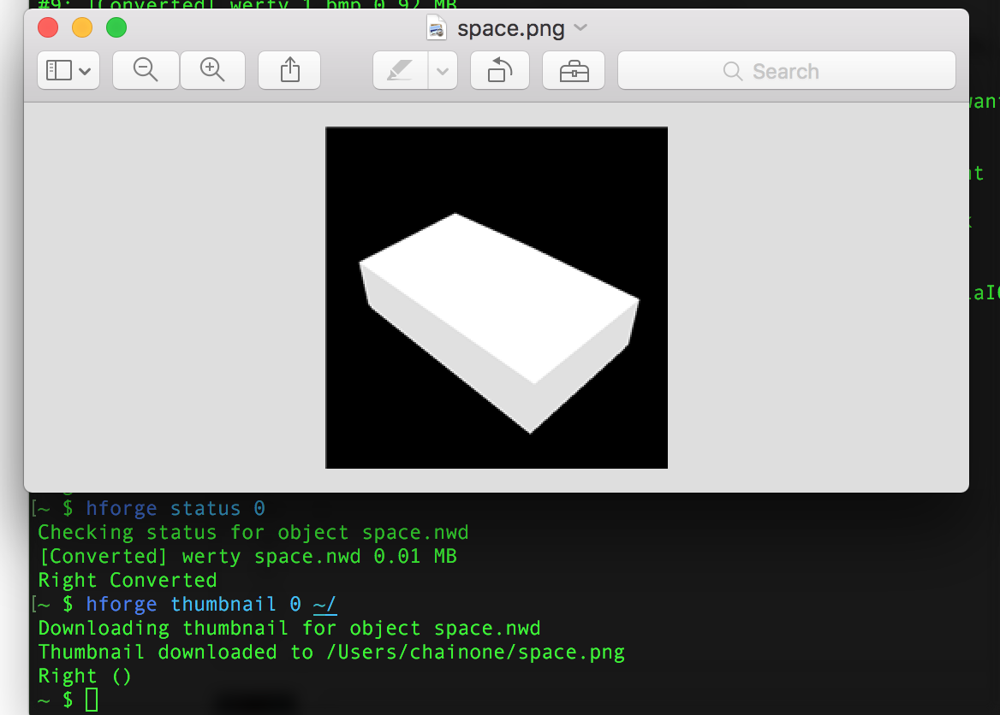
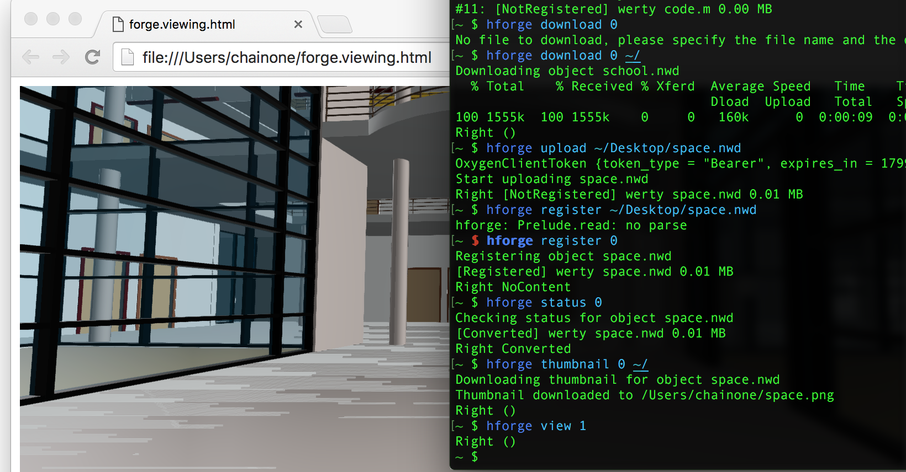

# HForge
A Haskell-made client that connects to Autodesk Forge (Data and View) APIs    
Powered by Haskell Servant & Persistent    

This commond line tool aims to make developers' life easier to deal with Autodesk Data and View APIs    
One single comannd line can help you do one of the following things:    
1. Remeber your app id & secret    

    	~ $ hforge upload ~/Desktop/school.nwd 
    	Enter your Autodesk Forge Client Id:
    	test
    	Enter your Autodesk Forge Client Secret:
    	test

2. Handle token expircy transparently    
3. List files(models) you have and the status of those models  

    	~ $ hforge list
    	#0: [Converted] werty school.nwd 1.52 MB
    	#1: [NotRegistered] werty test.html 0.01 MB
    	#2: [Converted] werty Eircom Park.nwd 2.91 MB
    	#3: [Converted] werty Ice Stadium.nwd 1.89 MB
    	#4: [NotRegistered] werty BIM360_Plan_Test_Case.xlsx 0.10 MB
    	#5: [Converted] werty Core Data.pdf 3.27 MB
    	#6: [Converted] werty Functional Programming.pdf 0.60 MB
    	#7: [NotRegistered] werty seafile-1.2.0.apk 1.69 MB
    	#8: [Converted] werty guide.pdf 0.28 MB
    	#9: [Converted] werty 1.bmp 0.92 MB
    	#10: [Converted] werty first.rvt 5.65 MB
    	#11: [NotRegistered] werty code.m 0.00 MB

3. Upload files(models) to OSS    

    	~ $ hforge upload ~/Desktop/school.nwd 
    	Start uploading school.nwd
    	Right [NotRegistered] werty school.nwd 1.52 MB

4. Download files to local    

        ~ $ hforge download 0 ~/
    	Downloading object school.nwd
    	% Total    % Received % Xferd  Average Speed   Time    Time     Time  Current
    	Dload  Upload   Total   Spent    Left  Speed
    	100 1555k  100 1555k    0     0   160k      0  0:00:09  0:00:09 --:--:--  230k
    	Right ()

5. Register a model    

    	~ $ hforge upload ~/Desktop/space.nwd 
    	OxygenClientToken {token_type = "Bearer", expires_in = 1799, access_token = "LaI0uwqYDRTW2WcgjpzT8lP6Pb4B"}
    	Start uploading space.nwd
    	Right [NotRegistered] werty space.nwd 0.01 MB
    	~ $ hforge register 0
    	Registering object space.nwd
    	[Registered] werty space.nwd 0.01 MB

6. Check the conversion status of the model    

    	~ $ hforge upload ~/Desktop/school.nwd 
    	Enter your Autodesk Forge Client Id:
    	test
    	Enter your Autodesk Forge Client Secret:
    	test
    	~ $ hforge status 0
    	Checking status for object space.nwd
    	[Converted] werty space.nwd 0.01 MB
    	Right Converted

7. View thumbnail of the model    

    	~ $ hforge upload ~/Desktop/school.nwd 
    	Enter your Autodesk Forge Client Id:
    	test
    	Enter your Autodesk Forge Client Secret:
    	test
    	~ $ hforge thumbnail 0 ~/
    	Downloading thumbnail for object space.nwd
    	Thumbnail downloaded to /Users/chainone/space.png
    	Right ()

8. View the model in LMV viewer

